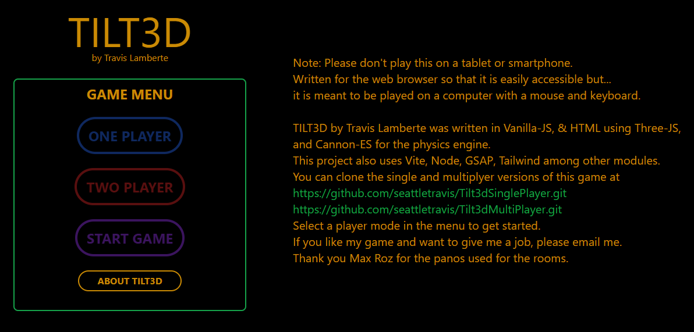
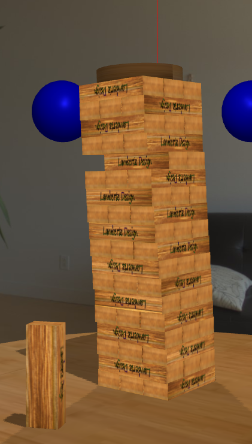
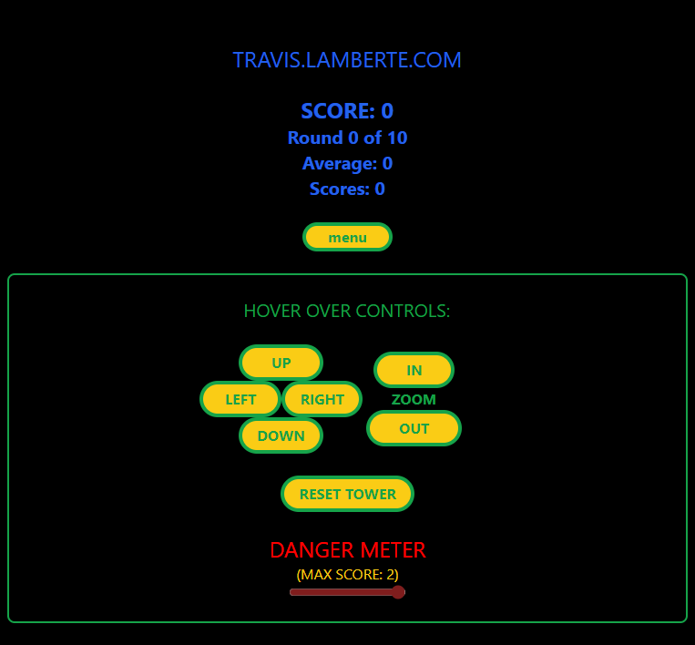

# Travis Lamberte - Dev Log is a Blog

## Date: 2/2/2024

## Title: Software Project that Didn't land a job! - Tilt3D

### Relevant Links: [Tilt3D!](https://travis.lamberte.com/tilt3dMenu/index.html)

I've been hashing over my journey to find a software job over the past 2 years, and I'm wondering what it is about 'me' that isn't 'hireable'?

I want to do several more blogs on this topic, and that is Software Projects that didn't land a job. There's a lot of prep to do in order to land a job in tech. From leaning the the basics of programming (what language to use and why, JSON, packaging, IDE's, package managers), technologies that are universal to software production environments like (Github, docker, kubernetes) and even how to interact with other programmers (scrum master, teams, CD/CI, UX/UI, mood boards). The list of stuff you need to know and know well goes on and on. But it's not only necessary to know all these things, you also have to show that you know them. So If you don't have a degree in CS (like me) and you don't have 5 years of experince (like me) then the best way to show off is with projects. And I'm not saying that projects are bad. I really like them. Its a way to flex the brain muscles, and to create something that didn't exist before. So in the early days of my coding journey I started developing some software projects that not only would show off my skills as a computer programmer would magically get me a job that I so desperately need. The very first project is Tilt3D written in JavaScript. Good old vanila JS.

I should first start by saying that I choose to study JavaScript because it's easier to build a project that can be distributed to a job seeker. What do I mean by this. When you have a website all the job seeker has to do is open the webpage in their browser. This is the easiest way to get your work in front of them, but for some reason I have no idea if it's working. So I leanred JS and build Tilt3D and threw it up on a static web page and put the link on my resume. What is Tilt3D? let's check it out.

When you go to the website you're greeted with a very nice 1980's style game menu. Isn't it nice?

The game it's self is a table top skill based game modelled after Jenga in which a user has to use skill to get points. Here's a screen shot. of course if you want to play it you can it's online, free, and there's no ads.

The technical:

The game is written in JavaScript, HTML, and CSS. I used the Vite framework, and ThreeJS to render the game pieces, lights, shadows, and environment and I used CannonES for the pyhisics engine. I don't want to make it sound like I'm some sort of smart guy, but all of this work is not easy, it requires a bit of skill. I really thought a recuiter would appreciate the amount of skill that I needed to have in order to build this project. There's saying that it taked a lot of work to make something look like it took no work at all. The tiles are simple cubes with textures applied to each side. I added 2 dozen different wood textures and applied the randomly to the sides of the blocks then added my lamberteDesign logo to the sides. The blocks are stacked in a way that they'll just settle in such a way that they settle with out the tower falling over. It may seem like the CannonES physics engine is has duplicated real world physics... but no. it's not even close. It's like another universe. There's free energy at play that's always trying to make the tower shake apart. Gravity on earth is harsh. Things fall so fast. No one would like it if I set the gravity in the game to real world gravity. It's not what you think it would be like. All of these things I had to experiment with and tweek until I had a working game.

I learned a lot about physics engines building this game, a lot about how to build light objects, cameras, shapes, and apply textures. How to move lights, game pieces, and cameras around in ThreeJS. I also learned some great JS tricks, some HTML fundatmentals, and even some CSS working on the game menu.

This was the first project that I really used Git/Github on. I had some other repos on Guthub before this, but this project was the first one that I really used git features. If i went down a rabit hole that ended up breaking my code they I could revert back to an earlier commit. I was really able to explore VS Codes features, using some plugins that help facilitate a happier programming experience. It isn't that big of a secret but VS Code has hot keys for almost everything. And that is truely an awe inspiring statement when you really thing about it. It's like an everything bagel hold the mouse. No mouse.

I hosted this project on the Cpanel static web page. I set up a subdomain and hosted it. I know it's not the same a setting up a hard server in my garage and hosting the website, but it's still part of the suite of technologies that were touched getting the project online.

The physics engine (CannonES) was one of those things that seems very itimidating, but with some ThreeJS under my belt I was able to get set a very solid foundation using it. A lot of the physics objects looked a lot like the ThreeJS objects. They did live in their own libraries so there was special code segements that updated the position of all the ThreeJS objects based on the what the physics calculations returned from the engine. CannonES had a development mode that showed a rough outline render of where the object was and what it was doing. This was used in conjunction with the ThreeJS render to make sure that the Three object and the Cannon object were indeed bound to each other. So after a lot of leaning it was only a matter of building, toying, and playing before I realized that the game was indeed possible and that I was getting along at it.

What is a game with out the user interface and user controls?

The controls for Tilt3D are fairly involve. The mouse is used to control the place on the screen where the cursor is, which is a point tied to the raycaster. When the mouse button is clicked ThreeJS can add all Three objects that the ray intersects with into a list, which we use to take the 1st oject which is the Three oject that we are hovering the mouse over. This is how we select the block and also the pick point that we tie to the cursor, so when the mouse button is held down the effect is we drag the block by the specific pick point around in the environment. Now that we can pick up objects we can build a score system around it. We add 2 score sphere into the enviroment that are located oposite the camera in reference to the tower. When we move the camera in reference to the table and tower we also have to move the score spheres. It looks like we're moving the tower but what we're really doing is moving the camera and score spheres. Now that we have a system to score, we'll check to see if a tile is picked and if the raycaster event is also hovering over the score sphere, if it is when we release the mouse button we recieve points and the game score system is updated.

How

This project took me 6 weeks. From start to finish. Working more or less 40hrs/week.
